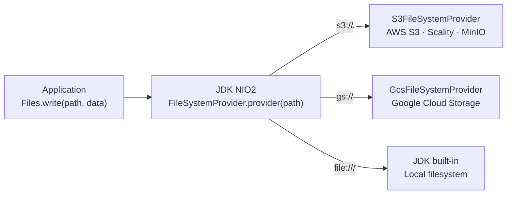

# Unified Storage

> Transparent cloud storage for Java applications — zero business code changes.

[](https://openjdk.org/projects/jdk/21/)
[](https://spring.io/projects/spring-boot)
[]()
[]()

---

## What is it?

Unified Storage is a Spring Boot library that routes standard Java NIO2 file operations to cloud object stores — S3, GCS, or local filesystem — based on a URI scheme in `application.yml`.

Your application keeps calling `Files.write()`, `Files.readAllBytes()`, `Files.copy()`. Nothing in the business code changes.

```java
// Before — NFS path injected from application.yml
Path path = Path.of(URI.create("/mnt/nfs/reports/" + filename));
Files.write(path, content);

// After — S3 URI injected from application.yml. Code is identical.
Path path = Path.of(URI.create("s3://my-bucket/reports/" + filename));
Files.write(path, content);   // transparent multipart upload
```

The only change is the value of one property in `application.yml`.

---

## Why?

Legacy applications use NFS-mounted paths for file I/O. Containerising them on public or private cloud requires moving off NFS. Asking each team to learn AWS SDK or GCS SDK and rewrite their I/O code would take years and introduce regression risk in critical batch and compliance code.

Unified Storage absorbs all cloud complexity in one place. Teams add one Maven dependency, update some YAML lines, and the migration is done.

---

## Quick Start

### 1. Add the dependency

```xml
<!-- S3 or S3-compatible (Scality, MinIO, LocalStack) -->
<dependency>
    <groupId>edu.m4z</groupId>
    <artifactId>unified-storage-s3</artifactId>
    <version>1.0.0</version>
</dependency>

<!-- Google Cloud Storage -->
<dependency>
    <groupId>edu.m4z</groupId>
    <artifactId>unified-storage-gcs</artifactId>
    <version>1.0.0</version>
</dependency>
```

Auto-configuration activates automatically. No `@EnableXxx` annotation needed.

### 2. Configure a mount point

```yaml
unified-storage:
  reports:
    path: s3://my-bucket/data/reports
    region: eu-west-1
    access-key: ${S3_ACCESS_KEY}
    secret-key: ${S3_SECRET_KEY}
```

### 3. Update the injected path

```java
// Before
@Value("${app.storage.reports-path}")
private String reportsPath;

// After — same field, different source
@Value("${unified-storage.reports.path}")
private String reportsPath;

// Everything below is unchanged
public void save(String name, byte[] data) throws IOException {
    Path path = Path.of(URI.create(reportsPath + "/" + name));
    Files.createDirectories(path.getParent());
    Files.write(path, data, StandardOpenOption.CREATE, StandardOpenOption.TRUNCATE_EXISTING);
}
```

That's it.

### 4. Local / test profile

```yaml
# application-test.yml
unified-storage:
  reports:
    path: file:///tmp/test-reports
  posix:
    enabled: false
```

Same code, local filesystem, no credentials, no Docker.

---

## Features

| Feature | Description |
|:--------|:------------|
| **Transparent NIO2 routing** | `s3://`, `gs://`, `file://` URIs dispatched via Java SPI |
| **S3 Multipart Upload** | Automatic above `multipart-threshold` (default 64 MB) |
| **GCS Resumable Upload** | Used for all GCS writes; native resume on network failure |
| **Cross-provider streaming copy** | `Files.copy(s3Path, gcsPath)` — no temp file, 100 GB compatible |
| **Range reads** | `newRangeInputStream(path, offset, length)` for selective access |
| **POSIX metadata** | Optional DB-backed emulation of permissions, ownership, timestamps |
| **Multi-mount** | Multiple buckets and providers coexist in the same application |
| **S3-compatible stores** | MinIO, Scality, LocalStack via `endpoint` override |
| **Secret resolution** | `secret://cyberark/...` credentials via Secret Manager Starter |
| **Structured logging** | `@Slf4j` + MDC-compatible on every class |

---

## Module Structure

```
unified-storage/
    unified-storage-core/    # SPI contract, registry, cross-copy, POSIX
    unified-storage-s3/      # S3 provider — AWS SDK v2 2.25.0
    unified-storage-gcs/     # GCS provider — GCS SDK 26.39.0
    unified-storage-demo/    # Reference Spring Boot application
```

Applications only package what they need. Adding `unified-storage-s3` does not pull GCS on the classpath.

---

## Supported URI Schemes

| Scheme | Provider | Backends |
|:-------|:---------|:---------|
| `s3://bucket/path` | `S3FileSystemProvider` | AWS S3, Scality, MinIO, LocalStack |
| `gs://bucket/path` | `GcsFileSystemProvider` | Google Cloud Storage |
| `file:///path` | JDK built-in | Local filesystem |
| `abfs://` | Planned | Azure Blob Storage |



---

## Requirements

| | Version |
|:-|:--------|
| Java | **21** |
| Spring Boot | **3.3.x** |
| Maven | 3.8+ |
| POSIX metadata (optional) | JDBC datasource — PostgreSQL recommended |

---

## Documentation

| | |
|:--|:--|
| [Architecture](docs/architecture.md) | How NIO2 SPI works, Spring bridge, delegation chain, large file internals |
| [Configuration](docs/configuration.md) | Full property reference with examples |
| [Custom Provider](docs/custom-provider.md) | Adding a new storage backend |
| [Security](docs/security.md) | Credential chains, GDPR surface, audit trail |
| [FAQ](docs/faq.md) | Common questions and troubleshooting |
| [Changelog](CHANGELOG.md) | Version history |
| [Contributing](CONTRIBUTING.md) | Development workflow and standards |
| [Security Policy](SECURITY.md) | Vulnerability reporting |

---

## License

All Rights Reserved

Copyright (c) 2026 Mehrez Ben Salem

All rights reserved.

This source code and all associated files are the exclusive property of the author.

No part of this codebase may be:
- used,
- copied,
- modified,
- merged,
- published,
- distributed,
- sublicensed,
- or sold

without explicit prior written permission from the author.

Unauthorized use is strictly prohibited.
