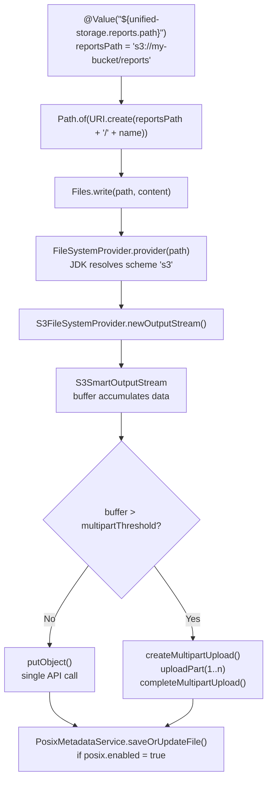
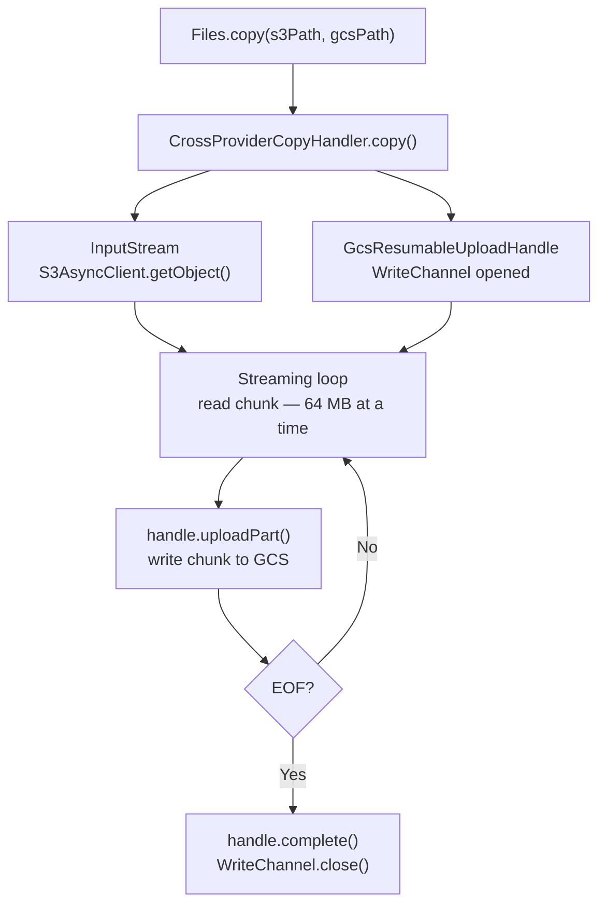
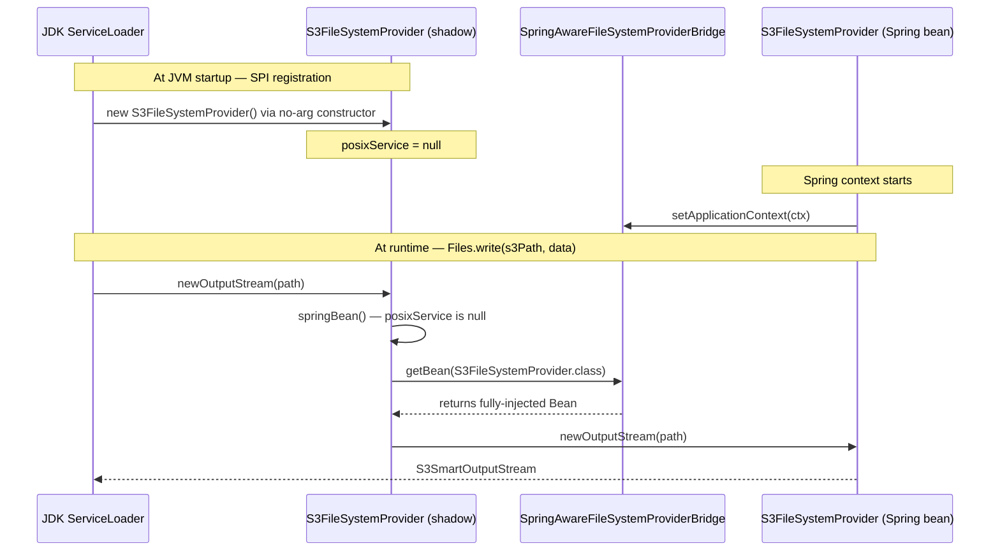
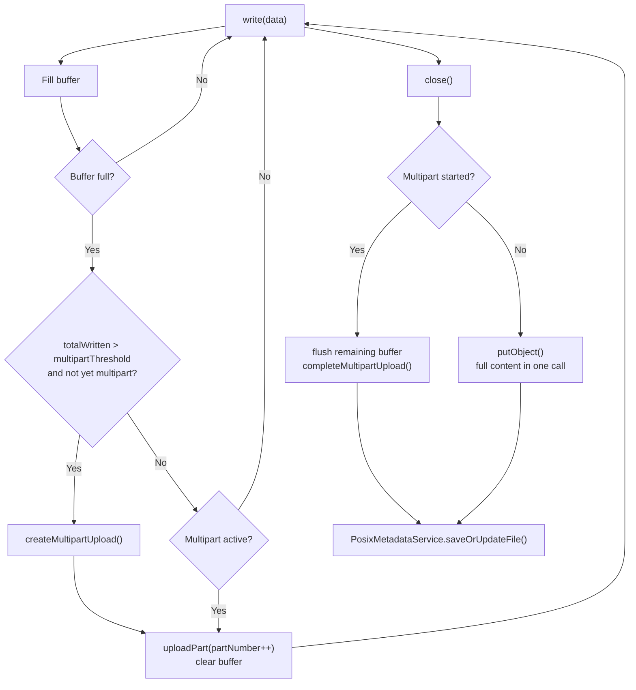
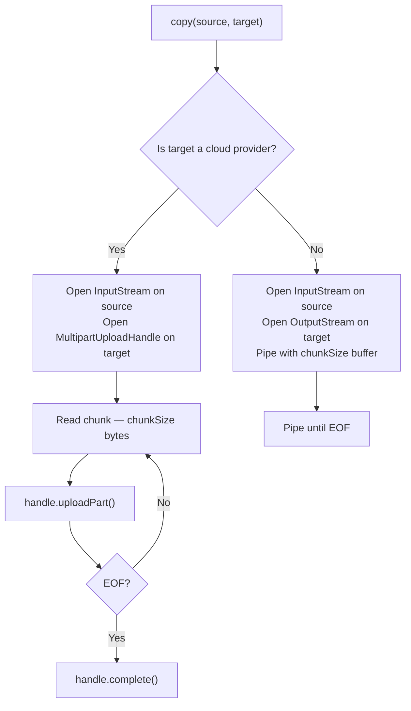
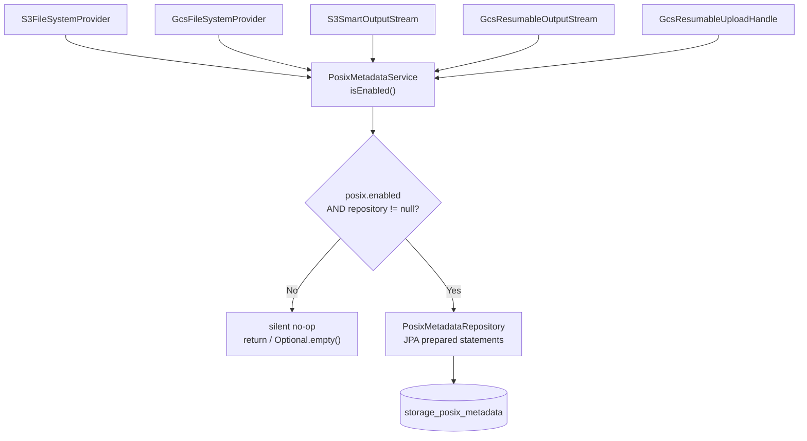
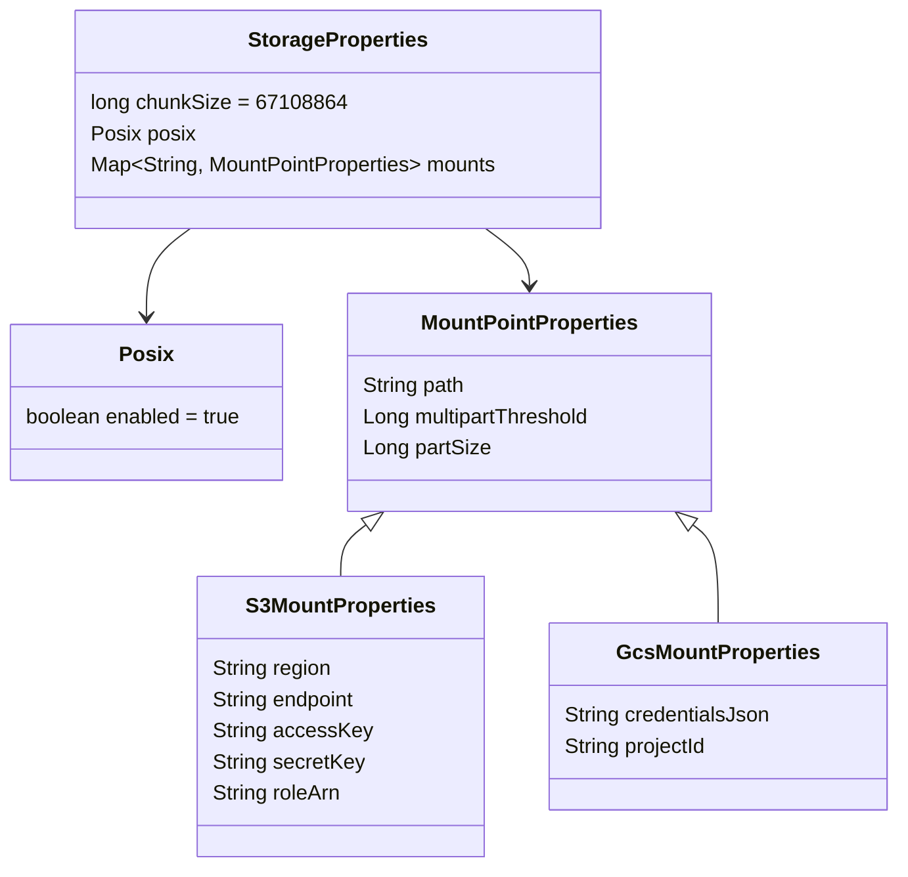

# Architecture Guide

> A deep dive into how Unified Storage is structured, how data flows, and why each design decision was made.

---

## Table of Contents

- [Design Philosophy](#design-philosophy)
- [Module Structure](#module-structure)
- [Data Flow](#data-flow)
- [Java NIO2 SPI — The Foundation](#java-nio2-spi--the-foundation)
- [Spring Boot Integration Bridge](#spring-boot-integration-bridge)
- [Large File Handling](#large-file-handling)
- [Cross-Provider Copy](#cross-provider-copy)
- [POSIX Metadata Layer](#posix-metadata-layer)
- [Configuration Hierarchy](#configuration-hierarchy)
- [Observability](#observability)

---

## Design Philosophy

Unified Storage is built around three core principles:

1. **Zero business code changes** — developers should not need to learn a new API, import a cloud SDK, or add conditionals for local vs. cloud. The application writes `Files.write()` and the bytes go where the YAML says.

2. **Provider independence** — switching from S3 to GCS (or adding Azure Blob) should require changing a URI in `application.yml`, not refactoring application code.

3. **Fail-safe non-critical paths** — POSIX metadata failures must never break a storage operation. Only actual I/O errors propagate to the application.

---

## Module Structure

```
unified-storage/
    unified-storage-core/    # The engine — SPI contracts, registry, cross-copy, POSIX
    unified-storage-s3/      # S3 and S3-compatible providers
    unified-storage-gcs/     # Google Cloud Storage provider
    unified-storage-demo/    # Full Spring Boot demo application
```

`unified-storage-core` has no cloud SDK dependency. Each provider module depends only on its own SDK. An application using only S3 has no GCS SDK on its classpath.

---

## Data Flow

### Write (startup resolution + runtime)



### Cross-provider copy



---

## Java NIO2 SPI — The Foundation

Java NIO2 uses a service-loader mechanism to discover `FileSystemProvider` implementations. Each provider declares itself at:

```
META-INF/services/java.nio.file.spi.FileSystemProvider
```

The JDK reads this file once at startup. From that point, any `Path` whose URI scheme matches a registered provider routes to it — automatically, transparently.

This is the same mechanism used by Apache Hadoop (`hdfs://`), Google Jimfs (in-memory filesystem), and JDBC `DriverManager`. It is a JDK standard, not a library-specific extension.

**What makes this powerful for migration:** existing application code never changes. The URI scheme in `application.yml` is the only switch.

---

## Spring Boot Integration Bridge

Java SPI and Spring Boot have a fundamental tension: SPI requires a no-arg constructor and instanciates providers **outside** the Spring context. `@Autowired` fields are not injected in SPI-created instances.

Unified Storage resolves this with `SpringAwareFileSystemProviderBridge`:



Every provider method goes through `springBean()`. All operations always execute on the fully-injected instance.

The `required = false` on `posixService` is intentional: when `posix.enabled: false`, no `PosixMetadataRepository` bean is created (no datasource required). `PosixMetadataService` handles the null-repository case internally.

---

## Large File Handling

### S3 — S3SmartOutputStream

The stream maintains a single in-memory buffer of `partSize` bytes.



**Memory:** at most `partSize` bytes (default 64 MB) in memory regardless of file size.

**Failure safety:** if `close()` throws, `abortMultipartUpload()` is called before re-throwing. This releases the in-progress upload on S3 and avoids orphaned storage charges.

### GCS — GcsResumableOutputStream

GCS does not have a multipart API equivalent to S3. The library uses the **GCS Resumable Upload** protocol via `WriteChannel`. Data flows through `ByteBuffer` slices; the SDK manages chunk boundaries and HTTP sessions internally. On network failure, the SDK resumes from the last acknowledged byte.

### Range reads

Applications that process only a portion of a large file can avoid loading the full file:

```java
InputStream in = provider.newRangeInputStream(path, offset, length);
```

- S3: `Range: bytes=offset-(offset+length-1)` on `GetObject`
- GCS: `ReadChannel.seek(offset)` + `ReadChannel.limit(end)`

---

## Cross-Provider Copy

When `Files.copy(source, target)` is called with paths on two different providers, `CrossProviderCopyHandler` streams bytes directly between them.



**Memory profile:** `chunkSize` bytes maximum (default 64 MB). A 200 GB copy uses 64 MB of heap.

**Failure:** `handle.abort()` is called in the `catch` block. Partial data is discarded on the target.

---

## POSIX Metadata Layer

Cloud object stores have no concept of Unix permissions, file ownership, or sub-second access timestamps. The `PosixMetadataService` emulates these via the `storage_posix_metadata` table.

### Single control point



Providers call the service. They never call the repository directly. The flag is the single, non-negotiable control point.

### When disabled

- All methods are silent no-ops
- `find()` always returns `Optional.empty()`
- No JPA datasource required
- `readAttributes()` falls back to cloud-native timestamps (S3 `lastModified`, GCS blob timestamps)

### Database schema

```sql
CREATE TABLE storage_posix_metadata (
    id           VARCHAR(36)   PRIMARY KEY,
    virtual_path VARCHAR(2048) NOT NULL UNIQUE,  -- e.g. s3://bucket/path/file.csv
    parent_path  VARCHAR(2048),
    name         VARCHAR(512),
    owner        VARCHAR(255),
    grp          VARCHAR(255),
    permissions  INT           NOT NULL DEFAULT 420,  -- 0644 octal
    created_at   TIMESTAMP,
    modified_at  TIMESTAMP,
    accessed_at  TIMESTAMP,
    size         BIGINT        NOT NULL DEFAULT 0,
    is_directory BOOLEAN       NOT NULL DEFAULT FALSE,
    link_target  VARCHAR(2048)
);
```

---

## Configuration Hierarchy



---

## Observability

### @Slf4j

All classes use `@Slf4j` (Lombok). The generated `Logger` is byte-for-byte identical to a hand-written `LoggerFactory.getLogger(ClassName.class)` — but eliminates the copy-paste class-name mistake that causes misleading log output.

### Key log events

| Level | Message |
|:------|:--------|
| `INFO` | `POSIX metadata management: ENABLED / DISABLED` |
| `INFO` | `Mount 'reports' → s3://bucket (scheme: s3)` |
| `INFO` | `S3 multipart upload completed: s3://... (N parts, X bytes)` |
| `INFO` | `GCS Resumable upload completed: gs://... (X bytes)` |
| `INFO` | `Cross-provider copy completed: N parts uploaded` |
| `WARN` | `Failed to save POSIX metadata for ...: ...` (non-blocking) |

### MDC and thread boundaries

SLF4J `Logger` and `MDC` are part of the same API — fully compatible, no adapter needed.

```java
try (var m = MDC.putCloseable("mountName", "reports")) {
    Files.write(path, content);
    // log lines from S3SmartOutputStream will include mountName
}
```

**Important:** `S3AsyncClient` executes `CompletableFuture` callbacks on its own thread pool. MDC entries set on the HTTP thread are not propagated automatically. Capture and restore explicitly if needed:

```java
Map<String, String> ctx = MDC.getCopyOfContextMap();
s3Client.putObject(req, body).thenApply(res -> {
    if (ctx != null) MDC.setContextMap(ctx);
    try {
        log.debug("Upload complete");
        return res;
    } finally {
        MDC.clear();
    }
});
```

GCS writes use `WriteChannel.write()` synchronously on the calling thread — no thread boundary issue.
