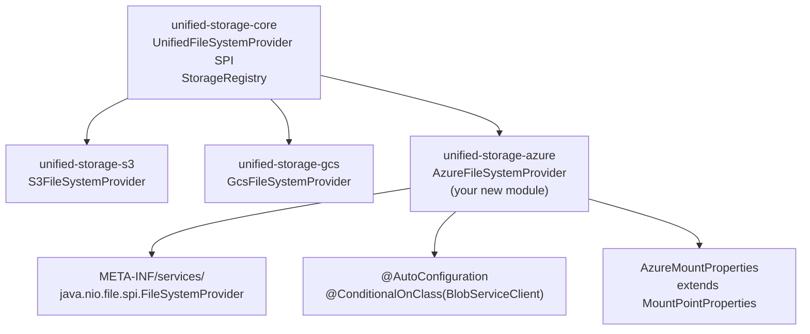

# Writing a Custom Provider

> Step-by-step guide to adding a new storage backend to Unified Storage.

---

## Table of Contents

- [Overview](#overview)
- [Creating a Storage Provider](#creating-a-storage-provider)
  - [Step 1: Create the Module](#step-1-create-the-module)
  - [Step 2: Define Mount Properties](#step-2-define-mount-properties)
  - [Step 3: Implement the Provider](#step-3-implement-the-provider)
  - [Step 4: Implement FileSystem and Path](#step-4-implement-filesystem-and-path)
  - [Step 5: Register via SPI](#step-5-register-via-spi)
  - [Step 6: Add Auto-Configuration](#step-6-add-auto-configuration)
- [Testing Your Provider](#testing-your-provider)
- [Checklist](#checklist)

---

## Overview

Unified Storage uses Java's **Service Provider Interface (SPI)** for extensibility. Adding a new backend means:

1. Implementing a Java abstract class
2. Registering it in a `META-INF/services/` file
3. Adding a Spring Boot auto-configuration

No changes to `unified-storage-core` are needed. `StorageRegistry` discovers new providers automatically by collecting all `UnifiedFileSystemProvider` beans from the Spring context.



The example below implements **Azure Blob Storage** (`abfs://` scheme).

---

## Creating a Storage Provider

### Step 1: Create the Module

```xml
<!-- unified-storage-azure/pom.xml -->
<parent>
    <groupId>edu.m4z</groupId>
    <artifactId>unified-storage-parent</artifactId>
    <version>1.0.0</version>
</parent>

<artifactId>unified-storage-azure</artifactId>

<dependencies>
    <dependency>
        <groupId>edu.m4z</groupId>
        <artifactId>unified-storage-core</artifactId>
    </dependency>
    <dependency>
        <groupId>com.azure</groupId>
        <artifactId>azure-storage-blob</artifactId>
        <version>12.25.0</version>
    </dependency>
</dependencies>
```

---

### Step 2: Define Mount Properties

```java
@Data
@EqualsAndHashCode(callSuper = true)
public class AzureMountProperties extends MountPointProperties {

    /**
     * Azure Storage account name. Required.
     * Example: myaccount
     */
    private String accountName;

    /**
     * Azure Storage account key.
     * If null, DefaultAzureCredential is used (Managed Identity, env vars).
     * Supports secret:// resolution.
     */
    private String accountKey;

    /** Azure AD tenant ID — required for service principal auth. */
    private String tenantId;

    /** Azure AD client ID — required for service principal auth. */
    private String clientId;

    /** Azure AD client secret — supports secret:// resolution. */
    private String clientSecret;
}
```

---

### Step 3: Implement the Provider

```java
@Slf4j
@Component
public class AzureFileSystemProvider extends UnifiedFileSystemProvider {

    private static final String SCHEME = "abfs";

    @Autowired(required = false)
    private PosixMetadataService posixService;

    private final Map<String, BlobServiceClient>    clientsByMount         = new ConcurrentHashMap<>();
    private final Map<String, AzureFileSystem>      fileSystemsByContainer = new ConcurrentHashMap<>();
    private final Map<String, MountPointProperties> mountConfigs           = new ConcurrentHashMap<>();
    private long defaultChunkSize = 64 * 1024 * 1024L;

    public AzureFileSystemProvider() {}  // required by Java SPI

    // Delegate to the Spring bean — same pattern as S3 and GCS
    private AzureFileSystemProvider springBean() {
        if (posixService != null) return this;
        if (SpringAwareFileSystemProviderBridge.isReady()) {
            return SpringAwareFileSystemProviderBridge.getBean(AzureFileSystemProvider.class);
        }
        return this;
    }

    @Override
    public String getScheme() { return SCHEME; }

    @Override
    public void registerMount(String mountName, MountPointProperties props) {
        mountConfigs.put(mountName, props);
        AzureMountProperties azure = toAzureProps(props);
        BlobServiceClient client = buildClient(azure);
        clientsByMount.put(mountName, client);
        URI uri = URI.create(props.getPath());
        fileSystemsByContainer.computeIfAbsent(uri.getHost(),
            c -> new AzureFileSystem(this, c));
        log.info("Azure Blob mount '{}' → container '{}' account '{}'",
            mountName, uri.getHost(), azure.getAccountName());
    }

    @Override
    public InputStream newInputStream(Path path, OpenOption... options) throws IOException {
        AzureFileSystemProvider bean = springBean();
        AzurePath ap = bean.toAzurePath(path);
        return bean.resolveClient(ap)
            .getBlobContainerClient(ap.getContainer())
            .getBlobClient(ap.getBlobName())
            .openInputStream();
    }

    @Override
    public InputStream newRangeInputStream(Path path, long offset, long length) throws IOException {
        AzureFileSystemProvider bean = springBean();
        AzurePath ap = bean.toAzurePath(path);
        BlobRange range = new BlobRange(offset, length);
        return bean.resolveClient(ap)
            .getBlobContainerClient(ap.getContainer())
            .getBlobClient(ap.getBlobName())
            .openInputStream(new BlobInputStreamOptions().setRange(range));
    }

    @Override
    public OutputStream newOutputStream(Path path, OpenOption... options) throws IOException {
        AzureFileSystemProvider bean = springBean();
        AzurePath ap = bean.toAzurePath(path);
        BlobClient blob = bean.resolveClient(ap)
            .getBlobContainerClient(ap.getContainer())
            .getBlobClient(ap.getBlobName());
        return new AzureBlockOutputStream(ap, blob, bean.resolveChunkSize(), bean.posixService);
    }

    @Override
    public MultipartUploadHandle initiateMultipartUpload(Path path) throws IOException {
        AzureFileSystemProvider bean = springBean();
        AzurePath ap = bean.toAzurePath(path);
        BlobClient blob = bean.resolveClient(ap)
            .getBlobContainerClient(ap.getContainer())
            .getBlobClient(ap.getBlobName());
        return new AzureBlockUploadHandle(ap, blob, bean.resolveChunkSize(), bean.posixService);
    }

    // Implement remaining FileSystemProvider abstract methods:
    // newByteChannel, newDirectoryStream, createDirectory, delete,
    // copy, move, isSameFile, isHidden, getFileStore, checkAccess,
    // getFileAttributeView, readAttributes, setAttribute
    // — follow the pattern in S3FileSystemProvider or GcsFileSystemProvider.

    // ── Helpers ──────────────────────────────────────────────────────────

    private static AzureMountProperties toAzureProps(MountPointProperties props) {
        if (props instanceof AzureMountProperties a) return a;
        // Test / fallback: wrap plain MountPointProperties
        AzureMountProperties a = new AzureMountProperties();
        a.setPath(props.getPath());
        a.setMultipartThreshold(props.getMultipartThreshold());
        a.setPartSize(props.getPartSize());
        return a;
    }

    private BlobServiceClient buildClient(AzureMountProperties props) {
        if (props.getAccountKey() != null) {
            return new BlobServiceClientBuilder()
                .connectionString("DefaultEndpointsProtocol=https;AccountName="
                    + props.getAccountName() + ";AccountKey=" + props.getAccountKey())
                .buildClient();
        }
        // Fallback: Managed Identity, env vars, etc.
        return new BlobServiceClientBuilder()
            .endpoint("https://" + props.getAccountName() + ".blob.core.windows.net")
            .credential(new DefaultAzureCredentialBuilder().build())
            .buildClient();
    }

    private AzurePath toAzurePath(Path path) {
        if (path instanceof AzurePath ap) return ap;
        return (AzurePath) getPath(path.toUri());
    }

    private BlobServiceClient resolveClient(AzurePath path) {
        return clientsByMount.values().stream().findFirst()
            .orElseThrow(() -> new IllegalStateException("No Azure Blob client configured."));
    }

    private long resolveChunkSize() {
        return mountConfigs.values().stream()
            .filter(m -> m.getPartSize() != null)
            .map(MountPointProperties::getPartSize)
            .findFirst().orElse(defaultChunkSize);
    }
}
```

---

### Step 4: Implement FileSystem and Path

`AzureFileSystem` extends `java.nio.file.FileSystem`. `AzurePath` extends `java.nio.file.Path`.

Follow the exact pattern of `S3FileSystem` / `S3Path` or `GcsFileSystem` / `GcsPath`.

Key requirements:
- `AzurePath.toUri()` must return `abfs://container/blobName`
- `AzureFileSystem.getSeparator()` returns `"/"`
- `AzureFileSystem.getPath(String first, String... more)` returns `AzurePath`

---

### Step 5: Register via SPI

Create the service registration file:

```
src/main/resources/META-INF/services/java.nio.file.spi.FileSystemProvider
```

Content:

```
edu.m4z.unifiedstorage.azure.AzureFileSystemProvider
```

---

### Step 6: Add Auto-Configuration

```java
@AutoConfiguration
@ConditionalOnClass(BlobServiceClient.class)
public class AzureAutoConfiguration {

    @Bean
    @ConditionalOnMissingBean(AzureFileSystemProvider.class)
    public AzureFileSystemProvider azureFileSystemProvider(StorageProperties props) {
        AzureFileSystemProvider provider = new AzureFileSystemProvider();
        provider.setDefaultChunkSize(props.getChunkSize());
        return provider;
    }
}
```

Register in:

```
src/main/resources/META-INF/spring/org.springframework.boot.autoconfigure.AutoConfiguration.imports
```

Content:

```
edu.m4z.unifiedstorage.azure.AzureAutoConfiguration
```

Configure and use:

```yaml
unified-storage:
  reports:
    path: abfs://my-container/data/reports
    account-name: myaccount
    account-key: secret://cyberark/conjur/azure/storage-key
```

That's it. `StorageRegistry` discovers the provider automatically.

---

## Testing Your Provider

Use a local emulator. For Azure Blob, use [Azurite](https://github.com/Azure/Azurite):

```java
@Testcontainers
@SpringBootTest
@ActiveProfiles("azurite")
class AzureProviderIT {

    @Container
    static GenericContainer<?> azurite =
        new GenericContainer<>("mcr.microsoft.com/azure-storage/azurite")
            .withExposedPorts(10000);

    @DynamicPropertySource
    static void configure(DynamicPropertyRegistry registry) {
        registry.add("unified-storage.reports.endpoint",
            () -> "http://localhost:" + azurite.getMappedPort(10000));
    }
}
```

At minimum, test:

- `registerMount()` with valid and invalid configuration
- `newOutputStream()` → `Files.write()` → `newInputStream()` → `Files.readAllBytes()`
- `newDirectoryStream()` listing
- `delete()` removing an object
- `initiateMultipartUpload()` path used by `CrossProviderCopyHandler`
- POSIX metadata with `posix.enabled: true` and `posix.enabled: false`

---

## Checklist

- [ ] `MountProperties` extends `MountPointProperties`, annotated `@Data @EqualsAndHashCode(callSuper = true)`
- [ ] Provider extends `UnifiedFileSystemProvider`, annotated `@Slf4j @Component`
- [ ] `springBean()` delegation pattern implemented
- [ ] All `FileSystemProvider` abstract methods implemented
- [ ] `toAzureProps()` cast helper with safe fallback
- [ ] `newRangeInputStream()` uses the backend's range read API
- [ ] `initiateMultipartUpload()` returns a `MultipartUploadHandle` implementation
- [ ] `PosixMetadataService` used for POSIX — no direct repository calls
- [ ] `@Slf4j` used — no manual `Logger` declaration
- [ ] No French in comments, Javadoc, or log messages
- [ ] SPI file at `META-INF/services/java.nio.file.spi.FileSystemProvider`
- [ ] Auto-configuration registered in `META-INF/spring/org.springframework.boot.autoconfigure.AutoConfiguration.imports`
- [ ] Integration tests with a local emulator
